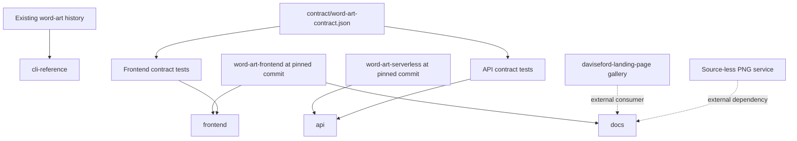
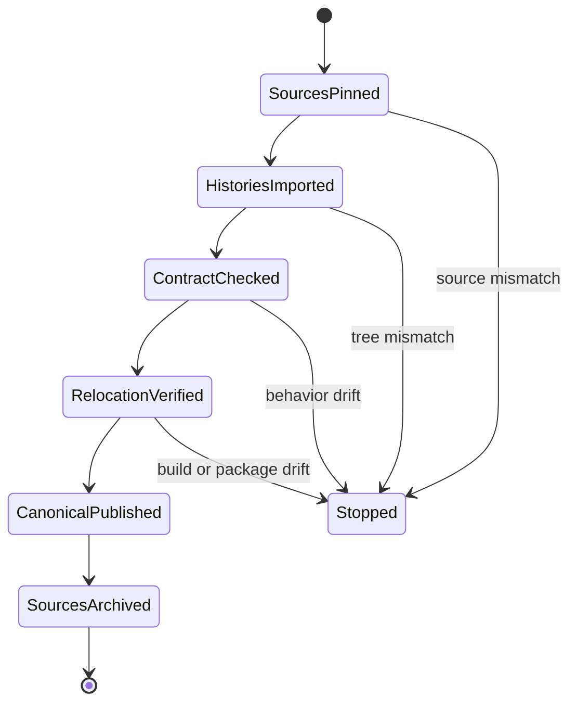

# Word Art Consolidation - Plan

## Goal Capsule

- **Objective:** Replace the active `word-art-frontend`, `word-art-serverless`, and legacy `word-art` repository split with one canonical `word-art` product repository while preserving source histories, runtime behavior, and independent deployment mechanisms.
- **Authority:** The Product Contract in this plan governs product scope. Repository instructions govern component safety and verification.
- **Execution profile:** Deep, history-preserving, cross-repository refactor. It relocates and documents existing code; it does not redesign runtime behavior or deploy production.
- **Stop conditions:** Stop if a selected source commit cannot be preserved, imported files differ from their source snapshot, a relocated component requires runtime/config changes to build, a verification step would mutate production, or a source repository would be deleted.
- **Tail ownership:** The existing `daviseford/word-art` repository becomes canonical. The two superseded repositories are redirected and archived only after the merged repository passes every applicable verification gate and the maintainer approves the remote-state change.

---

## Product Contract

### Summary

Consolidate the complete Word Art product into path-isolated frontend, API, and CLI-reference directories in the existing `word-art` repository. Preserve the current deploy surfaces, add one test-enforced cross-language contract, centralize product documentation, and retire the superseded repositories without deleting them.

### Problem Frame

Word Art is one product fragmented across three repositories: a webpack/jQuery frontend, a Python Lambda API, and their dormant Python 2 CLI ancestor. The frontend and API cross an HTTP boundary but duplicate their color fields, minimum-quality gate, turtle-path representation, and sentence parsing rules without a shared authority, so compatible behavior can drift silently.

The split also makes a solo maintainer track three histories, instruction sets, and documentation locations for one product. The other daviseford.com repositories use unrelated stacks and remain independent; only Word Art has a strong product boundary that justifies consolidation.

### Requirements

**Repository consolidation**

- R1. One `word-art` repository replaces the three repositories, with top-level `frontend/`, `api/`, and `cli-reference/` directories.
- R2. The dormant Python CLI moves under `cli-reference/` as read-only algorithm and history reference; no build or deployment depends on it.
- R3. The frontend and API retain their current build and deployment behavior from their new directories: the frontend keeps its webpack build and dry-run-first S3/CloudFront deployment, while the API keeps its Serverless Framework Lambda package and service identity. No live Lambda or frontend deployment occurs during consolidation.

**Contract and documentation**

- R4. A single canonical contract file captures at minimum the color DTO keys `bg_color`, `color`, `node_colors`, and `split_color`; the 20-segment quality boundary; the turtle-path encoding and direction cycle; and the frontend and fallback sentence-parsing rules. Existing frontend and API runtime implementations remain separate, while both test suites verify their behavior against this file.
- R5. The current frontend documentation hub moves to root `docs/` and becomes the merged product's documentation home.
- R6. Product documentation and the canonical contract record the source-less PNG conversion endpoint as an external black-box dependency and the gallery in `daviseford-landing-page` as an external consumer.

### Key Decisions

- **Group repositories by product, not in a family-wide monorepo.** (session-settled: user-directed — chosen over one monorepo for the daviseford.com family: the Ruby, Node, static, game, and Python stacks share too little tooling.) Governs R1, R3, R5.
- **Consolidate Word Art only.** (session-settled: user-directed — chosen over co-locating unrelated site applications: the landing page, blog, and consultant simulator remain distinct products.) Governs R1.
- **Relocate and document rather than refactor runtime code.** (session-settled: user-directed — chosen over shared JavaScript/Python runtime modules: preserving the revived live behavior is safer for a solo maintainer.) Governs R2, R3, R4.

### Success Criteria

- All three source histories remain reachable from the canonical repository, and the imported trees match their pinned source commits.
- `frontend/`, `api/`, and `cli-reference/` exist without nested Git repositories or a new root build/deploy orchestrator.
- Frontend tests and build, API tests and package, and CLI syntax verification run from their relocated component directories.
- The canonical contract is valid and the owning active component suite fails when a governed value or example drifts from it.
- The documentation hub is reachable at root `docs/`, and all component instructions and links resolve from their new locations.
- Production endpoint values, AWS resource names, Serverless service identity, frontend deployment destination, and tracked frontend artifacts remain behaviorally unchanged.
- The superseded frontend and API repositories point to the canonical repository and are archived only after verification and explicit approval.

### Acceptance Examples

- AE1. **History-preserving import.** Given the pinned frontend and API source commits, when consolidation completes, their root commits remain reachable in the target graph and every imported tracked file matches its source blob except documentation deliberately relocated within the target.
- AE2. **Deploy-neutral relocation.** Given a clean consolidated checkout, when the frontend dry-run path and API package path are exercised, they use the same production targets and service identity without uploading, invalidating, invoking, or deploying anything.
- AE3. **Contract drift detection.** Given a canonical quality threshold, palette DTO, parsing example, or turtle-path example, when either active implementation no longer matches it, the owning component test suite fails.
- AE4. **Reference-only CLI.** Given a clean consolidated checkout, when active frontend and API workflows run, no command imports, installs, builds, or executes `cli-reference/`.
- AE5. **Safe source retirement.** Given a verified canonical repository and maintainer approval, when source retirement completes, the old frontend and API repositories are read-only redirects with their histories intact rather than deleted repositories.

### Scope Boundaries

#### Deferred for later

- A reusable deployment workflow or CI adoption for any repository.
- A prefix-tenant registry for the shared daviseford.com bucket and the undocumented `consultant_simulator` tenant.
- A shared style or design-system layer.
- Recovering, replacing, or removing the source-less PNG conversion service.
- Replacing caller-controlled checksums, adding API abuse controls, changing public bucket policy, or addressing the broader revival-audit backlog.
- Modernizing the legacy webpack/Babel dependency tree or the Python 2 CLI.

#### Outside this consolidation

- Changes to `daviseford-landing-page`, the blog, or consultant simulator.
- Shared runtime modules across the frontend/API language boundary.
- Any successful production generation probe, frontend upload, CloudFront invalidation, Lambda deployment, stack removal, or cleanup operation.
- Deleting either superseded source repository.
- New sample texts, private submissions, or copyrighted fixtures.

### Deferred Open Question

- The frontend's PNG-conversion endpoint still has no source in the known repositories. This consolidation records its observed request/response boundary and risk but does not infer, test, or change the service's implementation.

### Roadmap Context

This consolidation is the first independent step in the maintainer's four-part repository-family cleanup. Reusable deploy automation, the prefix-tenant registry, and shared-style decisions remain separate follow-up workstreams and do not become dependencies of this plan.

---

## Planning Contract

Product Contract preservation: restructured, no scope change; R1-R6 retain their original meaning and IDs.

### Key Technical Decisions

- KTD1. **Use the existing `word-art` repository as the canonical home.** Its current remote is already `daviseford/word-art`, it contains the ancestor implementation and this plan, and retaining it avoids a repository rename or a fourth temporary home. Covers R1, R2, R5.
- KTD2. **Import complete source histories with non-squashed Git subtree integrations.** (session-settled: user-approved — chosen over a squashed import or fresh start: full provenance is cheap for these small repositories and keeps recovery/audit paths intact.) Use one separately auditable subtree integration per source, pin the frontend at `df6008f` and the API at `0b828a5`, and preserve the current CLI history already rooted in the target. The frontend commit must receive a durable ref because it is one commit ahead of `origin/master`. Covers R1, R2.
- KTD3. **Keep each active component as a path-isolated project.** (session-settled: user-directed — chosen over unified runtime tooling: deploy neutrality requires each existing manifest's scripts and dependencies, lockfile, working directory, service name, and deployment script to remain authoritative.) Do not introduce a root package workspace, shared virtual environment, root deploy command, or cross-component runtime import. Covers R3 and the Product Contract's relocate-not-refactor decision.
- KTD4. **Use a versioned JSON contract consumed by tests, not runtime code.** (session-settled: user-approved — chosen over prose-only documentation or a shared runtime package: JSON is readable in both existing test stacks without a new dependency or production coupling.) Model shared request fields, palette shape, threshold semantics, path examples, parsing examples, and external boundaries while distinguishing the frontend's distinct-sentence gate from the API's rendered-segment gate. Covers R4, R6.
- KTD5. **Move the documentation hub to root and retain scoped component instructions.** Root documentation owns the product map and contract links; nested instructions keep component-specific runtimes, safety rules, and commands discoverable after relocation. Covers R2, R3, R5, R6.
- KTD6. **Retire source repositories through redirect plus archive, never deletion.** (session-settled: user-approved — chosen over deleting the repositories or leaving two active homes: archive mode removes ownership ambiguity while keeping a rollback and provenance surface.) Remote retirement occurs only after the canonical branch is published and verified from a clean clone. Covers R1 and AE5.
- KTD7. **Treat reproducibility drift as a blocker, not an opportunistic cleanup.** If relocation changes tracked frontend output, API packaging identity, component tests, or command behavior, stop and diagnose it separately rather than committing regenerated or modernized output into this consolidation. Covers R3.

### High-Level Technical Design





### Output Structure

```text
/
  AGENTS.md
  README.md
  contract/
    word-art-contract.json
  docs/
    FRONTEND_DEPLOYMENT.md
    REVIVAL_AUDIT.md
    SYSTEM_ARCHITECTURE.md
    plans/
  frontend/
    AGENTS.md
    package.json
    src/
    test/
    dist/
  api/
    AGENTS.md
    serverless.yml
    tests/
  cli-reference/
    AGENTS.md
    README.md
    txt/
```

The component directories retain their full imported trees; the abbreviated structure names only the ownership boundaries and new shared locations.

### Sequencing

1. Freeze recoverable source snapshots and create the history-preserving target layout.
2. Establish root and nested documentation/instruction ownership after paths are stable.
3. Add the canonical contract and parity tests against the relocated implementations.
4. Run the complete verification contract from a clean target checkout.
5. Publish the canonical repository, then redirect and archive source repositories after approval.

### System-Wide Impact

- **Maintainer workflow:** One checkout becomes authoritative, but component commands still run from `frontend/`, `api/`, or `cli-reference/`.
- **Deployment:** S3/CloudFront and Lambda remain separate operational surfaces with unchanged targets, credentials, and apply/deploy controls.
- **Runtime:** Browser, API, public buckets, PNG conversion, and gallery flows do not change.
- **History and recovery:** The target graph becomes the durable provenance surface; archived source repositories remain rollback references.
- **Documentation:** Product-wide architecture and risks move to root `docs/`; component details remain beside their code.

### Risks and Dependencies

| Risk or dependency | Consequence | Mitigation / stop condition |
|---|---|---|
| Frontend commit `df6008f` is not on `origin/master` | Importing the remote default loses the restored controls | Create a durable source ref and pin the import to the commit before mutation |
| A source worktree or ref changes during consolidation | The imported tree cannot be audited against research | Require clean tracked state, record source hashes, and compare imported blobs to the pinned trees |
| Relative-path assumptions surface only after nesting | A build, test, or script may read the wrong root | Run every existing workflow from its relocated component directory; treat required runtime/config edits as plan divergence |
| Frontend rebuild changes tracked `dist/` | Consolidation accidentally becomes a generated-output or toolchain change | Compare the post-build tree and stop rather than committing unexplained output |
| API packaging needs Docker and Serverless authentication | The strongest non-deploy artifact proof may be unavailable locally | Record the unmet prerequisite and do not archive source repositories until packaging succeeds in an authorized environment |
| A dry run is invoked with an apply/deploy flag | Production S3, CloudFront, Lambda, or S3 objects could mutate | Permit only the existing default frontend preview and API package command; stop on any production-mutation path |
| Source repositories are retired before target verification | Rollback and discoverability become harder during failure | Publish and verify a clean canonical clone first; require maintainer approval before archive changes |

### Alternatives Considered

- **Squashed or fresh imports:** Rejected by KTD2 because they discard useful provenance without meaningfully simplifying repositories with 53 and 26 commits.
- **A family-wide monorepo:** Rejected by the Product Contract because unrelated applications and stacks would share administration without shared product behavior.
- **A shared JavaScript/Python runtime package:** Rejected by the Product Contract and KTD3 because it changes live code and deployment coupling.
- **A prose-only contract:** Rejected by KTD4 because it documents drift after the fact but cannot make either current suite detect it.
- **Deleting source repositories:** Rejected by KTD6 because archiving achieves one active home while preserving recovery and historical links.

---

## Implementation Units

### U1. Build the history-preserving consolidated tree

- **Goal:** Create the three-directory product layout while retaining every source history and byte-for-byte source tree.
- **Requirements:** R1, R2, R3; KTD1, KTD2, KTD3, KTD7; AE1, AE4.
- **Dependencies:** None.
- **Files:**
  - `cli-reference/**`
  - `frontend/**`
  - `api/**`
  - `.gitignore`
- **Approach:**
  1. Capture immutable refs and recoverable bundles for all three source histories, including frontend commit `df6008f`.
  2. Relocate the target repository's existing CLI files into `cli-reference/` while leaving root `docs/` and repository metadata in place.
  3. Import the complete frontend and API histories through separate non-squashed Git subtree integrations beneath their target prefixes, without nested `.git` directories.
  4. Compare the imported trees before removing temporary source remotes, then reconcile ignore behavior without changing runtime source, manifests, lockfiles, deployment configuration, or tracked frontend artifacts.
- **Execution note:** Make the source-tree and Git-graph comparison before any documentation or contract edits obscure the mechanical import.
- **Patterns to follow:** Preserve the components' current path-local conventions: `frontend/webpack.config.js` and `frontend/serve.js` resolve from their directory, `frontend/deploy.ps1` resolves from its script root, and API tests/config resolve from `api/`.
- **Test scenarios:** Test expectation: none -- this is a structural Git migration. Tree, blob, executable-bit, and history comparisons plus the existing suites in the Verification Contract provide the proof.
- **Verification:**
  - Covers AE1. Each pinned source root commit is reachable from the target graph.
  - Source and imported tracked-file inventories, blob IDs, and executable bits match, with only the planned documentation relocation deferred to U2.
  - No nested Git repository exists, and active components do not depend on `cli-reference/`.

### U2. Establish product documentation and contributor boundaries

- **Goal:** Make root documentation authoritative while keeping component-specific operating and safety instructions beside each relocated component.
- **Requirements:** R2, R3, R5, R6; KTD5; AE2, AE4.
- **Dependencies:** U1.
- **Files:**
  - `README.md`
  - `AGENTS.md`
  - `frontend/README.md`
  - `frontend/AGENTS.md`
  - `frontend/package.json`
  - `api/README.md`
  - `api/AGENTS.md`
  - `cli-reference/README.md`
  - `cli-reference/AGENTS.md`
  - `docs/FRONTEND_DEPLOYMENT.md`
  - `docs/REVIVAL_AUDIT.md`
  - `docs/SYSTEM_ARCHITECTURE.md`
- **Approach:**
  1. Move the imported frontend documentation hub to root `docs/` and update its repository map, paths, verification locations, and current source-state statements.
  2. Replace the root CLI-only overview and instructions with product-level navigation, command scoping, contract ownership, and no-deploy safety boundaries.
  3. Adjust nested README and instruction links for the consolidated paths, and point the frontend package's repository, issue, and homepage metadata at the canonical home without changing scripts or dependencies.
  4. Preserve each component's existing runtime and safety rules.
  5. Record the PNG service and gallery as external surfaces without inventing behavior or moving their ownership into this repository.
- **Patterns to follow:** Retain the verified architecture and revival findings from `docs/SYSTEM_ARCHITECTURE.md` and `docs/REVIVAL_AUDIT.md`; retain the dry-run-first language from `docs/FRONTEND_DEPLOYMENT.md`.
- **Test scenarios:** Test expectation: none -- documentation and instruction relocation does not change product behavior.
- **Verification:**
  - Every relative Markdown link resolves from its new file location.
  - Commands and safety notes name the correct component directory.
  - No documentation implies that the CLI is active, the PNG service is in-repo, or a merge deploys production.

### U3. Add the canonical contract and cross-runtime parity tests

- **Goal:** Turn the duplicated frontend/API rules into one reviewable authority that both existing suites enforce without runtime coupling.
- **Requirements:** R4, R6; KTD4; AE3.
- **Dependencies:** U1.
- **Files:**
  - `contract/word-art-contract.json`
  - `frontend/test/contract.test.js`
  - `api/tests/test_contract.py`
- **Approach:**
  1. Define a versioned JSON contract for palette keys and types, shared request/response fields, default/null semantics, threshold semantics, sentence examples, turtle-path examples, and external PNG/gallery boundaries.
  2. Represent the frontend's normalized distinct-sentence eligibility rule and the API's rendered-segment enforcement as related but distinct gates so the contract does not conceal their current behavior.
  3. Read the same root contract from both test suites using standard-library JSON support; do not import it from production runtime modules.
  4. Assert the contract against existing exported constants, parsing/path functions, color data, and handler validation rather than copying implementation values into new test helpers.
- **Execution note:** Add characterization assertions before changing documentation claims; any discovered mismatch is a planning divergence, not permission to rewrite runtime behavior.
- **Patterns to follow:** Extend `frontend/test/test.js` and `frontend/test/colors.test.js` conventions in the new frontend contract test; extend `api/tests/test_handler.py`, `api/tests/test_parsing.py`, and `api/tests/test_quality.py` conventions in the new API contract test.
- **Test scenarios:**
  - Covers AE3. A valid contract loads from both component working directories and exposes a supported contract version plus every required section.
  - Covers AE3. Every frontend palette contains all governed color fields, valid color values, and two node colors while retaining its non-contract display metadata.
  - Covers AE3. The frontend minimum remains 20, duplicate normalized sentences do not increase its distinct count, and punctuation/spacing normalization matches the contract examples.
  - Covers AE3. The API minimum remains 20 rendered segments, rejects 19-segment simple/split/fallback requests, and accepts canonical 20-segment examples without real S3.
  - Covers AE3. Frontend and API path builders follow the same left/down/right/up cycle and segment lengths for the contract's simple and color-split examples.
  - Covers AE3. API fallback parsing ignores empty trailing segments and counts words as specified, while the contract preserves the richer frontend normalization as the primary browser path.
  - The external PNG request/response observation and gallery consumer are present as documentation-only contract entries and are not treated as executable in-repo schemas.
- **Verification:**
  - The targeted contract tests pass from both component directories.
  - The full frontend and API suites pass with no production network or AWS access.
  - No runtime source file imports the contract.

### U4. Publish the canonical home and retire superseded repositories

- **Goal:** Make the consolidated repository the only active Word Art home while retaining recoverable, discoverable source archives.
- **Requirements:** R1, R3, R5; KTD6, KTD7; AE2, AE5.
- **Dependencies:** U1, U2, U3 and every applicable Verification Contract gate.
- **Files:**
  - `README.md` in `word-art-frontend`
  - `README.md` in `word-art-serverless`
  - GitHub repository descriptions and archive settings for `word-art-frontend` and `word-art-serverless`
- **Approach:**
  1. Verify the canonical branch from a clean clone before changing either source repository.
  2. Fast-forward the frontend source default branch to `df6008f`, then add its redirect commit so the archived landing branch preserves the intended final frontend state.
  3. Replace each source README's active-development guidance with a concise pointer to the canonical repository and its corresponding subdirectory.
  4. Publish the redirect commits, obtain explicit maintainer approval, then archive both superseded repositories without deleting branches, tags, releases, or the repositories themselves.
- **Execution note:** Treat GitHub archival as the final external-state mutation; do not combine it with any product deployment.
- **Patterns to follow:** Follow the repository-family links already used in the three README files, but make `daviseford/word-art` the sole active authority.
- **Test scenarios:** Test expectation: none -- this is a repository-governance and remote-state change performed only after local verification.
- **Verification:**
  - Covers AE5. A fresh clone of `daviseford/word-art` contains the imported histories, documentation, contract, and all component directories.
  - Both source repository landing pages point to the canonical home and are read-only after approval.
  - Neither source repository is deleted, and no frontend or API production deployment was triggered.

---

## Verification Contract

| Gate | Verification | Applies to | Done signal |
|---|---|---|---|
| Source and history integrity | Compare pinned source trees and executable bits with their imported prefixes; confirm all source root commits are reachable | U1 before any source retirement | No unexplained file, mode, or history difference |
| Frontend behavior | From `frontend/`, run the locked install, full Mocha suite, webpack build, PowerShell parser check, and local static-server smoke path | U1-U3 | Existing and contract tests pass; build succeeds; tracked `dist/` has no unexplained diff |
| Frontend deployment safety | From `frontend/`, exercise only the default deploy preview when approved AWS credentials are available; never pass `-Apply` | U4 | The script reaches S3 `--dryrun`, reports no unexpected deletions, and performs no upload or invalidation |
| API behavior | From `api/`, run the Python 3.13 pytest suite with fake S3 | U1-U3 | Existing rendering/storage/config tests and contract tests pass without AWS access |
| API packaging | From `api/`, run the locked Node install and Serverless package with Docker and authorized Serverless authentication; never deploy | U4 | A package is produced under the existing service/config identity and no stack call occurs |
| CLI reference | From `cli-reference/`, run the Python 2.7 syntax compilation documented by the component | U1, U2 | The four legacy Python modules compile without adding a runtime dependency to active components |
| Documentation | Check root and nested Markdown links, repo references, component command locations, and contract links | U2, U3 | All local links resolve and external ownership boundaries are accurate |
| Canonical-clone proof | Repeat applicable component gates from a clean clone of the target remote before archive approval | U4 | The target remote alone is sufficient to build, test, package, and understand the product |

Any unavailable prerequisite is recorded as an unmet verification gate, not silently waived. Production deployment, production POST probes, cleanup commands, and archive operations before approval are prohibited verification methods.

---

## Documentation and Operational Notes

- Use an isolated consolidation branch in the target repository and keep source snapshots recoverable outside the working tree until the target remote and source archives are verified.
- Source repository changes are limited to preserving the intended final ref, adding redirects, and applying approved archive settings after target verification.
- Before source archival, rollback means abandoning the target consolidation branch and leaving source repositories active. After archival, rollback means unarchiving the intact source repositories; deletion is never part of either path.
- Keep `frontend/deploy.ps1`, `frontend/upload.sh`, `api/serverless.yml`, manifest scripts and dependencies, lockfiles, endpoint values, bucket names, and Serverless service name unchanged unless verification exposes an actual relocation blocker. U2 may update repository metadata only; any runtime/config blocker returns to planning rather than expanding this refactor.
- Do not commit temporary bundles, fetched remotes, package artifacts, virtual environments, caches, or abandoned migration experiments.

---

## Sources and Research

- `AGENTS.md`, `frontend/AGENTS.md`, and `api/AGENTS.md` define the legacy/runtime boundaries, no-deploy rules, and component verification expectations.
- `docs/SYSTEM_ARCHITECTURE.md` defines the current browser-to-Lambda-to-PNG flow, wire fields, storage model, and external gallery boundary.
- `docs/REVIVAL_AUDIT.md` records the revived runtime baselines, known contract drift, missing PNG source, and test gaps that must not be folded into this consolidation.
- `frontend/package.json`, `frontend/webpack.config.js`, `frontend/deploy.ps1`, and `frontend/test/deploy.test.js` show a self-contained frontend whose build and dry-run deployment resolve from the component directory.
- `api/package.json`, `api/serverless.yml`, `api/handler.py`, and `api/tests/` show a self-contained Python 3.13/Serverless 4.40.0 API with fake-S3 verification and non-deploy packaging.
- `cli-reference/parse_text.py` and `cli-reference/svg.py` preserve the original sentence-count and rotating-path algorithm but are not production dependencies.
- Repository research on 2026-07-23 found 12 commits in `word-art`, 53 in `word-art-frontend`, and 26 in `word-art-serverless`; the selected frontend state is local commit `df6008f`, one commit ahead of its remote default branch.

---

## Definition of Done

- The Product Contract remains satisfied without runtime behavior, dependency, deployment-target, or infrastructure changes.
- U1 is complete when all source histories and pinned trees are present under the intended prefixes with no nested repositories.
- U2 is complete when root documentation is authoritative, nested instructions are correctly scoped, and every local link resolves.
- U3 is complete when one canonical JSON contract is enforced by both active suites and no runtime module depends on it.
- U4 is complete when the canonical remote passes clean-clone verification and the two source repositories are redirected and archived after explicit approval, not deleted.
- Every applicable Verification Contract gate passes; unmet packaging or credential prerequisites prevent source retirement.
- No live deployment, successful production generation request, object cleanup, or repository deletion occurred.
- The final diff contains no temporary migration artifacts, regenerated drift, dead-end code, or unrelated cleanup.
