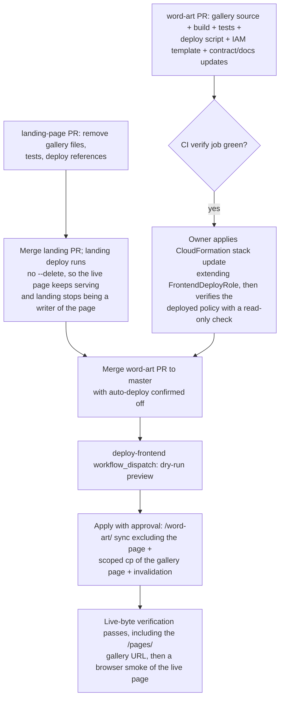

# Gallery Ownership Migration - Plan

**Target repos:** `word-art` (primary; plan home) and `daviseford-landing-page` (removal side). Paths are repo-relative; landing-page paths are marked.

## Goal Capsule

- **Objective:** Move the public Word Art gallery from `daviseford-landing-page` into this repo's `frontend/` component, so word-art builds, tests, and deploys the gallery, while the landing-page repo drops it entirely.
- **Authority:** This plan's Product Contract governs scope. Root and `frontend/` `AGENTS.md` govern component safety and verification; their deploy-approval rules override any implied step here.
- **Execution profile:** Cross-repo relocation. No functional or visual redesign; the gallery's live URL and data source are unchanged.
- **Stop conditions:** Stop if the IAM deploy-role change cannot be applied (the CloudFormation stack update is owner-manual — CI cannot self-grant); before running `frontend/deploy.ps1 -Apply`, `workflow_dispatch` deployment, or any live AWS mutation without explicit approval; if the frontend and API contract suites cannot be made to pass in lockstep; if any step would delete objects the landing page still serves.
- **Tail ownership:** Word-art owns the gallery after cutover. The landing-page removal merges and deploys first — retiring the old writer while the live page keeps serving from the bucket — and the word-art deploy then takes over publishing the page, with owner approval gating the production cutover.

---

## Product Contract

### Summary

Relocate the gallery page, its stylesheet, its S3-listing JS module, and its tests into `frontend/`, integrate them into the webpack build and the gated S3/CloudFront deploy, keep the live URL `daviseford.com/pages/word-art-gallery.html`, and remove every gallery reference from `daviseford-landing-page`.

### Problem Frame

The gallery is the display surface for compositions generated by this repo's product, yet it lives in the landing-page repo — this repo's own `AGENTS.md`, README, architecture doc, and cross-language contract all record it as an external consumer. That split means gallery changes ride an unrelated repo's deploy, and the product's public pages are maintained in two places with duplicated styling conventions. The maintainer judged this boundary incorrect: the gallery belongs with the product.

### Requirements

**Gallery in word-art**

- R1. The gallery page, a self-contained gallery stylesheet, and the `WordArtGallery` JS module live under `frontend/src/` and are emitted into `frontend/dist/` by the webpack build.
- R2. Gallery behavior is unchanged: anonymous ListObjectsV2 paging of the public `word-art-pngs` bucket, newest-first sort, 12-per-page pagination with `?page=` URLs, CanvasPop print links, and the existing accessibility structure (skip link, aria-live status).
- R3. The live URL stays `https://daviseford.com/pages/word-art-gallery.html`; existing inbound links (including `frontend/src/index.html`'s own links) keep working with no redirect.
- R4. The page's CSS and JS are served from under `/word-art/` with the existing `?v=<assetVersion>` cache-busting scheme.

**Deployment**

- R5. `frontend/deploy.ps1` publishes the gallery page to bucket key `pages/word-art-gallery.html` and the gallery assets via the existing `/word-art/` sync, preserving dry-run/`-Apply` separation, the strict dist-artifact allowlist, CloudFront invalidation of every changed path, and post-deploy live-byte (SHA-256) verification of every artifact including the gallery URL.
- R6. The GitHub Actions frontend deploy role gains permission to write exactly the one new object outside the `word-art/` prefix — nothing broader.

**Ownership records**

- R7. The cross-language contract and all docs that record the gallery as external to this repo are updated to record word-art ownership, and both contract test suites (frontend and API) pass against the updated contract.

**Landing-page removal**

- R8. `daviseford-landing-page` drops the gallery page, gallery CSS/JS (including minified copies), gallery tests, and every deploy-script and doc reference to them; its remaining test suite, minify scripts, and deploy keep passing.

### Scope Boundaries

- No visual or functional redesign of the gallery; carried-over styles preserve the page's current look, including the landing page's heading scale. One deliberate exception: carried-over hover styles are gated behind `@media (hover: hover)` so touch devices don't latch sticky hover states (documented iOS learning in the landing repo).
- The `word-art-pngs` bucket, its public-listing ACL, and the PNG-conversion service are untouched.
- No CSS-minification pipeline is added to word-art; the gallery stylesheet ships unminified like `app.css`, dropping the landing repo's `.min` naming.

**Deferred to Follow-Up Work**

- Deleting the orphaned S3 objects the landing sync leaves behind (`assets/css/word-art-gallery.min.css`, `assets/js/aws-photo-gallery.min.js`). Landing-repo convention requires explicit admin action for object removal; they are harmless meanwhile.
- Removing the stale landing-repo worktree `.worktrees/gallery-deployment` (branch `fix/gallery-hero`, already merged).
- Unifying the PNG bucket URL style (`frontend/src/config.js` uses path-style; the gallery module uses virtual-hosted). Cosmetic only.
- Swapping the gallery module's `innerHTML`-based error/status rendering to `textContent` as a hardening pass — the pattern is pre-existing and out of relocation scope.

---

## Planning Contract

### Key Technical Decisions

- **Keep the public URL; word-art publishes it.** (session-settled: user-directed — chosen over relocating the gallery under `/word-art/` with a redirect: existing links and search results keep working with zero redirect infrastructure.) Governs R3, R5, R6.
- **Publish the page as a separate, exactly-scoped `aws s3 cp` — never widen the existing sync.** The deploy's `aws s3 sync --delete` would delete landing-page-owned files if its prefix broadened; the one out-of-prefix object gets its own copy step, its own invalidation path, and its own verification URL. The sync also excludes `word-art-gallery.html` so the page never publishes as a duplicate under `/word-art/` — the scoped copy is its only publish path. Grounded in the landing repo's documented `--size-only`/`--delete` deploy incidents (`daviseford-landing-page` `docs/solutions/integration-issues/s3-size-only-sync-silent-skips-and-line-ending-churn.md`). Governs R5.
- **Gallery assets ride the existing `/word-art/` sync.** (session-settled: user-approved — chosen over republishing them at their old `/assets/` paths: keeps the deploy-surface expansion to a single object.) The page references them by absolute `/word-art/...` URLs. Governs R4.
- **Self-contained gallery stylesheet.** (session-settled: user-approved — chosen over a live dependency on landing-page assets: the landing repo must be fully free of the gallery.) `word-art-gallery.css`'s `@layer gallery` copies nearly verbatim; only the base subset the page uses (~60–90 lines: tokens, reset, body/link/heading base, `.section-shell`, `.eyebrow`, `.skip-link`, `.site-footer`) is carried from `portfolio.css`. `frontend/src/app.css` already defines the identical token set and layer architecture, but its heading scale differs from the landing page's — the carried-over styles keep the landing values so the page renders identically. Governs R1, R2.
- **Gallery joins the webpack build.** (session-settled: user-approved — chosen over separately-maintained static files: one build, one artifact set, shared `assetVersion` cache-busting.) Second entry + second `HtmlWebpackPlugin` (`inject: false`), CopyPlugin pattern for the stylesheet. Adding gallery sources under `src/` automatically feeds the existing whole-of-`src` `assetVersion` hash — both pages cache-bust together, which is intended. Governs R1, R4.
- **IAM change is exact-object, and the stack update is a hard deploy gate.** Add a separate `PutObject`-only statement (Sid `PublishGalleryPage`) for `daviseford.com/pages/word-art-gallery.html` to the `FrontendDeployRole` policy — the existing `SynchronizeWordArtObjects` statement also grants `s3:DeleteObject`, which the page key must not receive (least privilege). The CloudFront statement is distribution-scoped, so invalidating `/pages/word-art-gallery.html` needs no IAM change. The stack is applied manually by the owner (see `docs/GITHUB_ACTIONS_DEPLOYMENT.md`) and must land before the first CI publish — a `PutObject` to `pages/` is AccessDenied under the current policy. Governs R5, R6.
- **Orphaned S3 objects stay.** (session-settled: user-approved — chosen over in-scope cleanup: landing deploys without `--delete`, so removal requires explicit admin action; the objects are unreferenced once the new page is live.) Governs R8.

### High-Level Technical Design

Bucket ownership after cutover — one bucket, two writers, one new out-of-prefix object:

| Bucket key(s) | Written by | Served as |
|---|---|---|
| `word-art/index.html`, `word-art/app.bundle.js`, `word-art/app.css` | word-art sync (`--delete`, unchanged) | `daviseford.com/word-art/` generator |
| `word-art/word-art-gallery... assets` (`gallery.bundle.js`, `gallery.css`) | word-art sync (new artifacts in `dist/`) | gallery CSS/JS under `/word-art/` |
| `pages/word-art-gallery.html` | word-art scoped `s3 cp` (new step) | the gallery page at its existing URL |
| everything else | landing-page sync (no `--delete`, unchanged) | `daviseford.com` site |

Cutover sequencing — the IAM gate and the auto-deploy variable make ordering load-bearing:

Removal-first eliminates the two-writer race: once the landing removal deploys, the landing sync no longer contains the page (and never deletes objects), so the old page keeps serving untouched — with its `portfolio.min.css` dependency still deployed for the landing page's own use — until word-art's scoped copy replaces it. No deploy-freeze discipline is needed, and code-complete in both repos no longer depends on a production deploy. Run the first gallery deploy via `workflow_dispatch` (dry-run preview, then apply) with `WORD_ART_FRONTEND_AUTO_DEPLOY` confirmed off until the cutover is verified — the auto-deploy push path applies without the dry-run preview.

### Assumptions and Constraints

- `frontend/dist/` is git-tracked and must contain the freshly built gallery artifacts in the same commit; the deploy workflow's push triggers already cover `frontend/src/**` and `frontend/dist/**`.
- Tests never touch real AWS: the gallery module's `listAllPhotos(fetchImpl)` injection point stays, and network-dependent paths stay untested, matching both repos' current practice.
- The `word-art-pngs` public-listing bucket ACL is load-bearing for the gallery (documented in the landing repo's `docs/solutions/conventions/bucket-public-listing-is-load-bearing.md`); word-art docs must now carry that warning so a future hardening pass doesn't break the page.
- Local `aws` CLI experiments on this Windows machine must set `MSYS_NO_PATHCONV=1` in Git Bash — `--paths /pages/...` otherwise mangles into a local filesystem path. CI runs from pwsh and is unaffected.
- The CanvasPop access key embedded in the gallery module is already public today and carries over as-is.

---

## Implementation Units

### U1. Gallery source files in frontend/src

- **Goal:** The gallery page template, self-contained stylesheet, and JS module exist under `frontend/src/`, restyled only in asset references.
- **Requirements:** R1, R2, R3, R4
- **Dependencies:** none
- **Files:** `frontend/src/word-art-gallery.html` (new, from landing `pages/word-art-gallery.html`), `frontend/src/gallery.css` (new, from landing `assets/css/word-art-gallery.css` + carried `portfolio.css` subset), `frontend/src/aws-photo-gallery.js` (new, from landing `assets/js/aws-photo-gallery.js`, unminified source), `frontend/src/gallery-entry.js` (new)
- **Approach:** Copy the unminified sources. In the template, repoint the two stylesheet links and the script tag to absolute `/word-art/gallery.css`, `/word-art/gallery.bundle.js` with `?v=<%= htmlWebpackPlugin.options.assetVersion %>` (the pattern `frontend/src/index.html` already uses); keep canonical link, favicons, meta, and body markup byte-equivalent otherwise. The entry file requires the UMD module and invokes `WordArtGallery.init()` on DOM readiness, replacing the inline script. The stylesheet keeps the landing page's token values and heading scale (see the self-contained-stylesheet decision); gate any carried hover styles behind `@media (hover: hover)` (iOS sticky-hover learning).
- **Patterns to follow:** `frontend/src/index.html` for versioned asset references and favicon params; `frontend/src/app.css` for the `@layer` architecture the gallery stylesheet mirrors.
- **Test scenarios:** covered by U3 (markup and module tests are written against these files).
- **Execution note:** Mostly relocation; prove it via U2's build output and U3's ported tests rather than new unit coverage here.
- **Verification:** Files exist; `npm run build` (after U2) consumes them without error.

### U2. Webpack multi-page build

- **Goal:** The build emits exactly six dist artifacts: the existing three plus `word-art-gallery.html`, `gallery.bundle.js`, `gallery.css`.
- **Requirements:** R1, R4
- **Dependencies:** U1
- **Files:** `frontend/webpack.config.js`, `frontend/serve.js`, `frontend/test/server.test.js`, `frontend/dist/` (rebuilt, committed)
- **Approach:** Add a `gallery` entry (`gallery-entry.js` → `gallery.bundle.js`) and a second `HtmlWebpackPlugin` (`inject: false`, `filename: 'word-art-gallery.html'`, template from U1, same `assetVersion` option); scope each plugin instance to its chunk. Add a CopyPlugin pattern for `gallery.css`. Teach `serve.js` to strip a leading `/word-art/` prefix so the gallery page's absolute asset URLs resolve during `npm start` local preview.
- **Patterns to follow:** the existing single-entry `HtmlWebpackPlugin` + CopyPlugin arrangement in `frontend/webpack.config.js`.
- **Test scenarios:**
  - Build emits exactly the six expected artifacts and no others (the deploy allowlist in U4 enforces this; a build-output assertion may ride the existing test conventions).
  - `serve.js` resolves `/word-art/gallery.css` and `/word-art-gallery.html` to dist files; path-traversal safety behavior is unchanged (extend `frontend/test/server.test.js`).
- **Verification:** `npm run build` from `frontend/` produces the six artifacts; `npm start` serves the gallery page with working styles locally.

### U3. Port gallery tests to mocha

- **Goal:** The landing repo's gallery test coverage lives in `frontend/test/` under mocha + chai `expect`.
- **Requirements:** R1, R2
- **Dependencies:** U1
- **Files:** `frontend/test/gallery-ui.test.js` (new, from landing `tests/gallery-page.test.js`), `frontend/test/gallery-module.test.js` (new, from landing `tests/aws-photo-gallery.test.js`)
- **Approach:** Markup tests follow the `frontend/test/ui.test.js` pattern — read `src/word-art-gallery.html` and `src/gallery.css` as strings, assert structure. Module tests `require` the UMD module directly (its `module.exports` branch) following `frontend/test/contract.test.js`; translate `node:test`/`assert` to mocha/`expect` only. `listAllPhotos`/`init` stay untested (DOM/network), as in the landing repo.
- **Test scenarios:**
  - Markup: skip link targets the gallery; canonical URL is `https://daviseford.com/pages/word-art-gallery.html`; asset references use `/word-art/` absolute paths with the version param; aria-live status and pagination nav present; "Create your own" link points at `/word-art/`.
  - `getPage`: happy path (page 1 of 25 items returns 12), boundary (requested page above page count clamps to last; page 0/garbage clamps to 1), empty item list yields one empty page.
  - `getPaginationWindow`: centered window mid-range; clamped at first and last pages; page count smaller than window.
  - `parsePageNumber`: valid `?page=3`; missing, non-numeric, negative, and zero all yield 1.
  - `sortPhotosNewestFirst`: orders by `LastModified` descending without mutating input.
  - `getCanvasPopUrl`: URL-encodes the image URL into the CanvasPop pull endpoint.
- **Verification:** `npm test` from `frontend/` passes with the new suites included.

### U4. Deploy script publishes the gallery

- **Goal:** `frontend/deploy.ps1` ships all six artifacts — assets via the existing sync, the page via a scoped copy — with dry-run parity, invalidation, and live-byte verification.
- **Requirements:** R5
- **Dependencies:** U2
- **Files:** `frontend/deploy.ps1`, `frontend/test/deploy.test.js`, `frontend/test/deploy-script.test.ps1`
- **Approach:** Extend `$ExpectedArtifacts` to the six artifacts (strict allowlist — build and allowlist must change together). Add `--exclude "word-art-gallery.html"` to the sync arguments so the page never publishes under `/word-art/` — the scoped copy below is its only publish path. After the sync, add a copy step for `dist/word-art-gallery.html` → `s3://daviseford.com/pages/word-art-gallery.html` that honors the same dry-run-default/`-Apply` semantics (dry-run prints the intended copy without mutating). Add `/pages/word-art-gallery.html` to the invalidation paths (assets are covered by `/word-art/*`). Give verification a per-artifact URL mapping: `word-art-gallery.html` verifies against `https://daviseford.com/pages/word-art-gallery.html`; the others keep the `SiteUrl + name` formula. Update the PowerShell mock harness's `Invoke-WebRequest` URL→dist mapping for the new URL, and the string assertions in `deploy.test.js`.
- **Patterns to follow:** the script's existing dry-run-first structure, `Invoke-External` wrapper, and SHA-256 verification loop; `deploy.test.js`'s string-assertion style.
- **Test scenarios:**
  - `deploy.test.js` asserts: the six-artifact allowlist; a `pages/word-art-gallery.html` copy step exists and is gated the same way as the sync (no un-gated `-Apply` path); the invalidation list includes `/pages/word-art-gallery.html`; the sync excludes `word-art-gallery.html`; the sync destination and `--delete` scope are unchanged (`s3://daviseford.com/word-art/` only).
  - Mock harness: full dry-run completes with no AWS mutation calls; apply path verifies all six artifacts including the gallery page via its distinct URL; a hash mismatch on the gallery page fails the run.
- **Execution note:** Never execute a real `-Apply` during implementation; the mock harness is the proof.
- **Verification:** `npm test` passes (including the PowerShell harness on Windows); a manual `./deploy.ps1 -BuildOnly` run succeeds.

### U5. IAM deploy-role extension

- **Goal:** The frontend deploy role can write exactly `daviseford.com/pages/word-art-gallery.html`.
- **Requirements:** R6
- **Dependencies:** none (merges with the word-art PR; applied manually before first deploy)
- **Files:** `infra/github-actions-deploy-roles.yml`, `frontend/test/deploy.test.js` (if it asserts the infra file), `docs/GITHUB_ACTIONS_DEPLOYMENT.md`
- **Approach:** Add a new policy statement (Sid `PublishGalleryPage`) granting only `s3:PutObject` on `arn:aws:s3:::daviseford.com/pages/word-art-gallery.html`; leave `SynchronizeWordArtObjects` untouched — it also grants `s3:DeleteObject` and `s3:AbortMultipartUpload`, which the page key must not receive. Leave the `ListWordArtPrefix` condition unchanged unless the chosen copy command requires list access (plain `aws s3 cp` of a single object does not). Document in `docs/GITHUB_ACTIONS_DEPLOYMENT.md` that the stack update must be applied by the owner before the first gallery deploy, and that after applying it the owner confirms the deployed role policy contains `PublishGalleryPage` with a read-only check (e.g. `aws iam get-role-policy`).
- **Test scenarios:** Test expectation: none beyond existing string assertions — infra template correctness is proven by the owner's manual stack update and the first gated dry-run; live IAM negative-testing is out of bounds (tests must not touch real AWS).
- **Verification:** CloudFormation template lints/validates; `deploy.test.js` assertions over the infra file pass; before the first publish, the owner's read-only policy check confirms the deployed role carries `PublishGalleryPage`.

### U6. Contract and docs record word-art ownership

- **Goal:** Every record of "the gallery is external to this repo" is updated, and both contract suites pass in lockstep.
- **Requirements:** R7
- **Dependencies:** U1 (file names/paths referenced by docs)
- **Files:** `contract/word-art-contract.json`, `frontend/test/contract.test.js`, `api/tests/test_contract.py`, `AGENTS.md`, `README.md`, `frontend/AGENTS.md`, `frontend/README.md`, `docs/SYSTEM_ARCHITECTURE.md`, `docs/FRONTEND_DEPLOYMENT.md`, `docs/GITHUB_ACTIONS_DEPLOYMENT.md`, `docs/REVIVAL_AUDIT.md`
- **Approach:** In the contract, rework `external_boundaries.gallery` to record the gallery as a first-party frontend page (ownership `word-art`), and record the `word-art-pngs` public-listing ACL as the load-bearing external dependency the gallery relies on; update the frontend and API contract tests to the new values together (root `AGENTS.md` requires both suites for contract changes). Update AGENTS/README ownership statements, the architecture doc's component table and gallery paragraphs, the deployment docs' artifact lists ("exactly three files" → six) and verification URLs, and add the gallery source/test files to `frontend/AGENTS.md`'s source-boundary and verification sections. Update `docs/REVIVAL_AUDIT.md`'s deploy-gating line that references the gallery frontend so it reflects word-art ownership. Leave the 2026-07-23 consolidation plan untouched as a historical record.
- **Test scenarios:**
  - `frontend/test/contract.test.js` asserts the new gallery ownership values and the PNG-bucket dependency record.
  - `api/tests/test_contract.py` asserts the same values; both suites pass against the same contract JSON.
- **Verification:** `npm test` from `frontend/` and `python -m pytest` from `api/` both pass; a docs pass finds no remaining "owned by daviseford-landing-page" claim (grep for `landing-page` across `AGENTS.md`, `README.md`, `docs/`; hits under `docs/plans/` are historical records and expected).

### U7. Landing-page removal

- **Goal:** `daviseford-landing-page` contains no gallery code, tests, or deploy references.
- **Requirements:** R8
- **Dependencies:** none — removal lands first by design. The landing sync has no `--delete`, so the live page keeps serving from the bucket after removal, and retiring landing as a writer before the word-art publish eliminates the window where a landing deploy could re-upload the old page over the new one.
- **Files (all in `daviseford-landing-page`):** delete `pages/word-art-gallery.html`, `assets/css/word-art-gallery.css`, `assets/css/word-art-gallery.min.css`, `assets/js/aws-photo-gallery.js`, `assets/js/aws-photo-gallery.min.js`, `tests/gallery-page.test.js`, `tests/aws-photo-gallery.test.js`; edit `package.json` (drop gallery targets from `minify:css`/`minify:js`), `upload_to_s3.sh` (drop the three gallery `cloudfront_paths` entries), `tests/deploy-workflow.test.js` (drop the three path assertions), `CLAUDE.md` (drop the gallery bullet), `README.md` (repo tree), `docs/solutions/conventions/bucket-public-listing-is-load-bearing.md` (repoint the gallery reference to its new home in word-art)
- **Approach:** Pure removal plus reference edits; `index.html` and `tests/landing-projects.test.js` need no changes (they link only to `/word-art/`, not the gallery page). The landing sync has no `--delete`, so removal cannot take the live page down; the old page serves from the bucket until word-art's deploy replaces it. Note the landing repo's `CLAUDE.md` permits direct commits to `master` (repo-local override of the global branch rule) — implementer's choice, but a PR is still fine.
- **Test scenarios:**
  - `npm test` passes with the gallery suites deleted and the deploy-workflow assertions trimmed.
  - `npm run minify` succeeds and regenerates only the remaining portfolio/wireframe/hover assets.
- **Execution note:** Config/removal work; smoke verification (`npm test`, `npm run minify`) over new unit coverage.
- **Verification:** Grep for `word-art-gallery` and `aws-photo-gallery` across the landing repo returns only historical docs (`docs/plans/`, solution docs by design).

---

## Verification Contract

| Command | Where | Proves | Applies to |
|---|---|---|---|
| `npm ci && npm test` | `frontend/` | mocha suites incl. ported gallery tests, deploy string assertions, PowerShell mock harness (Windows) | U1–U6 |
| `npm run build` | `frontend/` | exactly six dist artifacts; `git diff --exit-code -- frontend/dist/` after the build confirms the committed `dist/` matches the rebuild | U2, U4 |
| `python -m pytest` | `api/` (isolated env, Python 3.13) | contract lockstep — required because U6 edits `contract/` | U6 |
| `./deploy.ps1 -BuildOnly` | `frontend/` | build + allowlist gate without AWS credentials | U4 |
| `npm test && npm run minify` | `daviseford-landing-page` | landing suite and asset pipeline green after removal | U7 |

Quality gates: tests must not use real AWS (mock harness only); no `deploy.ps1 -Apply`, `workflow_dispatch` deployment, or live invalidation without explicit owner approval; post-cutover, live-byte verification of `https://daviseford.com/pages/word-art-gallery.html` is the deploy's own gate, not a test-suite concern.

---

## Definition of Done

- All five Verification Contract commands pass; the frontend PowerShell harness has run on Windows.
- The word-art repo carries the gallery source, tests, build artifacts, deploy steps, IAM template change, and updated contract/docs; no doc or contract line still records the gallery as external.
- The landing-page repo has no gallery code or deploy references, and its suite passes.
- Rollout is documented and gated: the landing removal deploys before the word-art publish, the CloudFormation stack update (verified with a read-only policy check) precedes the first gallery deploy, the first deploy runs via `workflow_dispatch` dry-run before `-Apply`, and live-byte verification plus a browser smoke of the live page cover the gallery URL. Executing the production deploy itself requires explicit owner approval and is not part of code-complete.
- No dead-end or experimental code remains in either repo's diff.
